# Bible Reader Application Architecture

**Version:** 1.0  
**Date:** May 2, 2026  
**Framework:** SvelteKit + TypeScript + Bun

---

## Table of Contents

1. [System Overview](#system-overview)
2. [Module Architecture](#module-architecture)
3. [Data Flow](#data-flow)
4. [User Journeys](#user-journeys)
5. [Component Hierarchy](#component-hierarchy)
6. [API Architecture](#api-architecture)

---

## System Overview

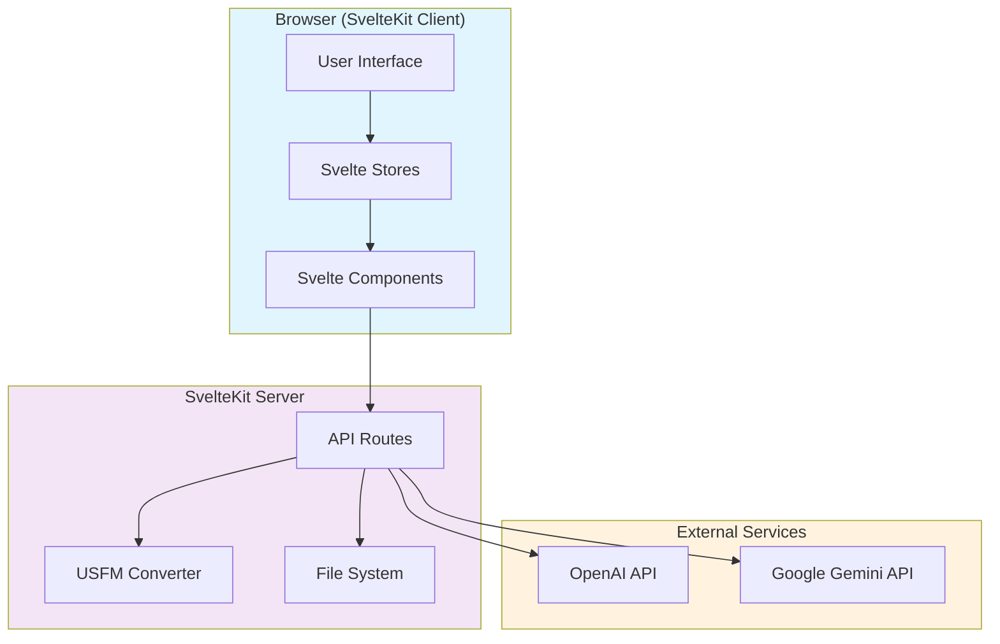

**Key Technologies:**
- **Frontend:** Svelte 5, TypeScript, svelte-golden-layout
- **Backend:** SvelteKit API routes (Node.js runtime)
- **USFM:** usfm-grammar (tree-sitter parser)
- **Storage:** File system (USFM files), localStorage (UI state)
- **Chat:** OpenAI (text + realtime voice), Google Gemini (live voice)

---

## Module Architecture

### Layer Diagram

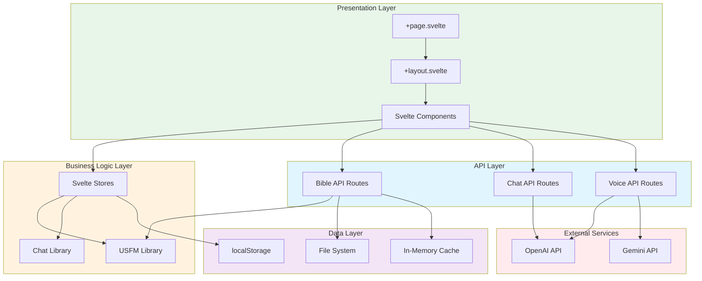

### Module Breakdown

**Presentation Layer:**
- `src/routes/+page.svelte` - Main application page
- `src/routes/+layout.svelte` - Root layout wrapper
- `src/lib/components/` - Reusable Svelte components
  - `ChatPanel.svelte` - Chat interface
  - `BiblePanelManager.svelte` - Bible panel orchestrator
  - `BibleReaderPanel.svelte` - Individual Bible viewer
  - `DockingLayout.svelte` - Panel docking system

**Business Logic Layer:**
- `src/lib/stores/` - Reactive state management
  - `chat.ts` - Chat messages, voice state
  - `bibles.ts` - Uploaded Bibles metadata
  - `panels.ts` - Panel layout/state
  - `navigation.ts` - Current book/chapter per panel
- `src/lib/usfm/` - USFM processing
  - `converter.ts` - USFM → HTML converter
  - `parser.ts` - USFM → USJ wrapper
- `src/lib/chat/` - Chat utilities
  - `voice.ts` - WebRTC/WebSocket helpers
  - `audio.ts` - Audio processing utilities

**API Layer:**
- `src/routes/api/bible/` - Bible management
  - `upload/+server.ts` - POST upload endpoint
  - `list/+server.ts` - GET list endpoint
  - `convert/[bibleId]/[bookId]/[chapter]/+server.ts` - GET convert
- `src/routes/api/chat/+server.ts` - POST text chat
- `src/routes/api/realtime/token/+server.ts` - GET OpenAI token
- `src/routes/api/transcribe/+server.ts` - POST audio transcription
- `src/routes/api/google-live/+server.ts` - WebSocket proxy

**Data Layer:**
- File System: `data/bibles/{bibleId}/{bookId}.usfm`
- localStorage: Panel layouts, UI preferences
- In-Memory: Session cache (converted chapters)

---

## Data Flow

### 1. Bible Upload & Display Flow

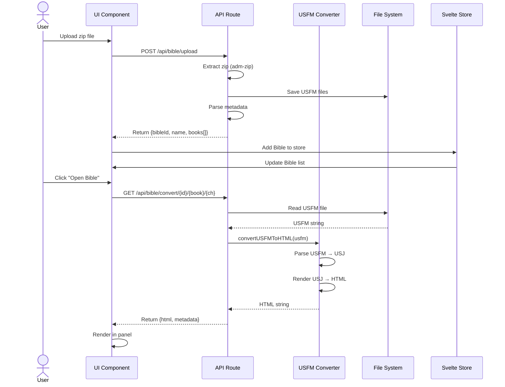

### 2. Chat & Voice Flow

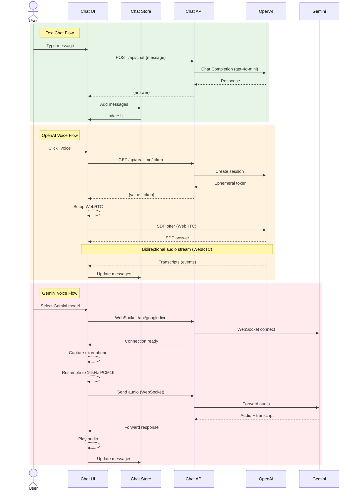

### 3. Panel Management Flow

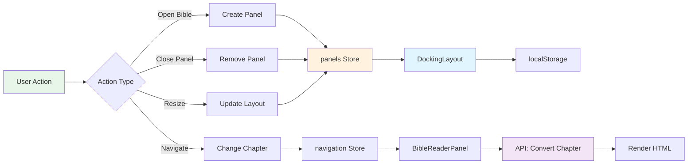

---

## User Journeys

### Journey 1: Upload and Read Bible

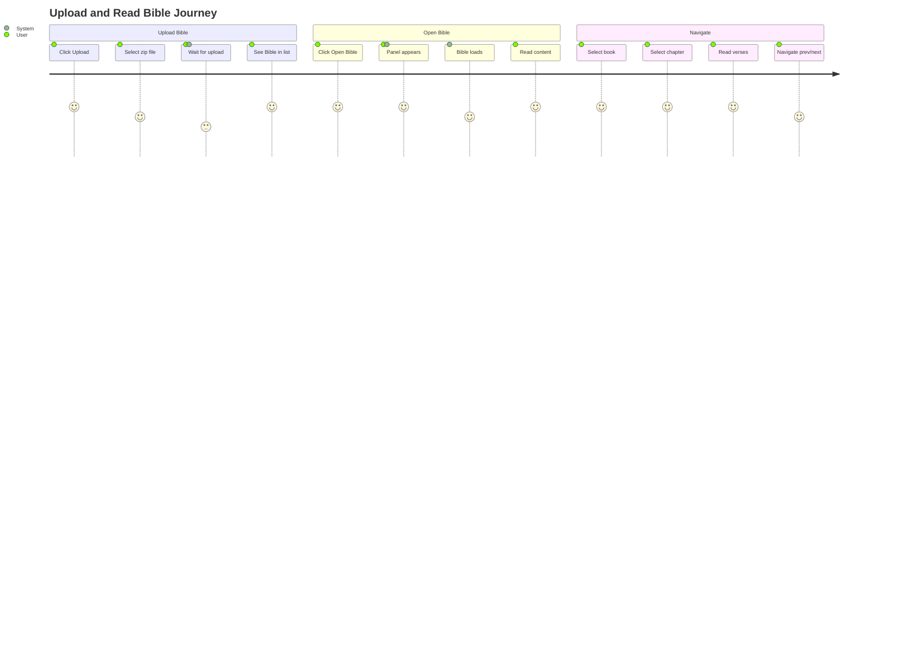

**Steps:**
1. User clicks "Upload Bible" button
2. User selects `.zip` file containing USFM files
3. System extracts and stores USFM files
4. System displays Bible name in sidebar
5. User clicks Bible name to open
6. System creates new panel with Bible reader
7. User selects book from dropdown (e.g., "Genesis")
8. User selects chapter (e.g., "1")
9. System converts USFM to HTML and displays
10. User reads formatted Bible text
11. User navigates using prev/next or dropdowns

**Success Criteria:**
- Bible uploads in < 5 seconds
- Chapter loads in < 500ms
- Text is properly formatted (verses, poetry, footnotes)
- Navigation is smooth and responsive

---

### Journey 2: Chat with AI Assistant

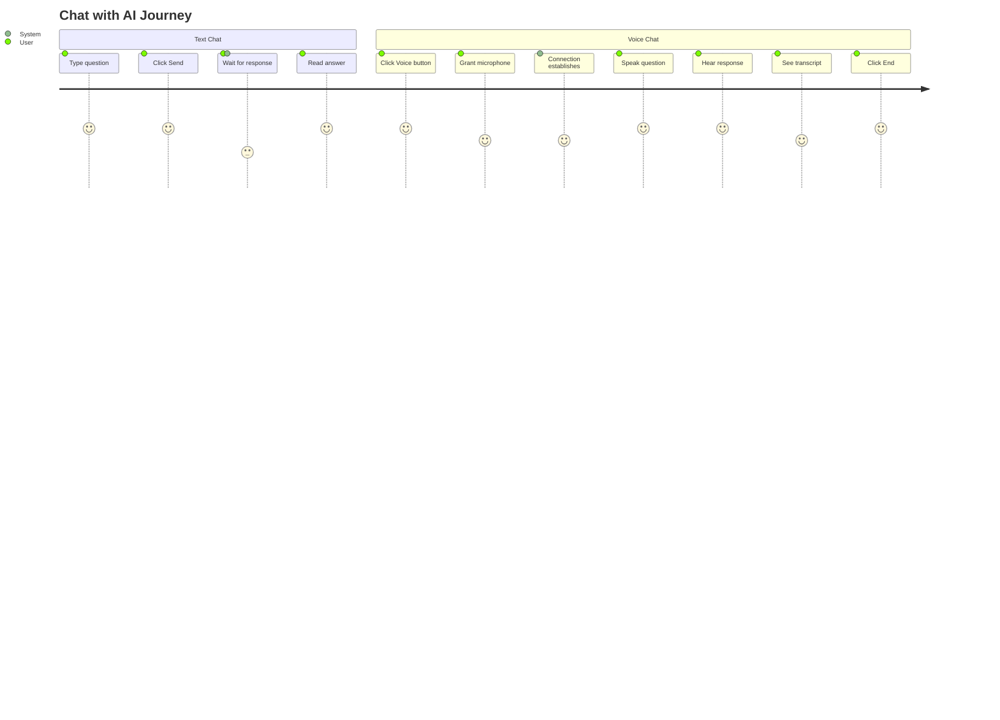

**Steps (Text):**
1. User types question in chat input
2. User clicks "Send" or presses Enter
3. System sends to OpenAI API
4. System displays assistant response
5. User reads answer

**Steps (Voice - OpenAI):**
1. User clicks "Voice" button
2. Browser requests microphone permission
3. User grants permission
4. System establishes WebRTC connection
5. User speaks naturally
6. System transcribes speech (displays)
7. Assistant responds with voice (auto-plays)
8. System shows transcript
9. User can interrupt or continue
10. User clicks "End" to stop

**Steps (Voice - Gemini):**
1. User selects Gemini model from dropdown
2. User clicks "Voice" button
3. System establishes WebSocket connection
4. User speaks naturally
5. System resamples audio to 16kHz PCM16
6. System streams audio to Gemini
7. Gemini responds with audio + transcript
8. System plays audio and displays transcript
9. User clicks "End" to stop

---

### Journey 3: Compare Multiple Translations

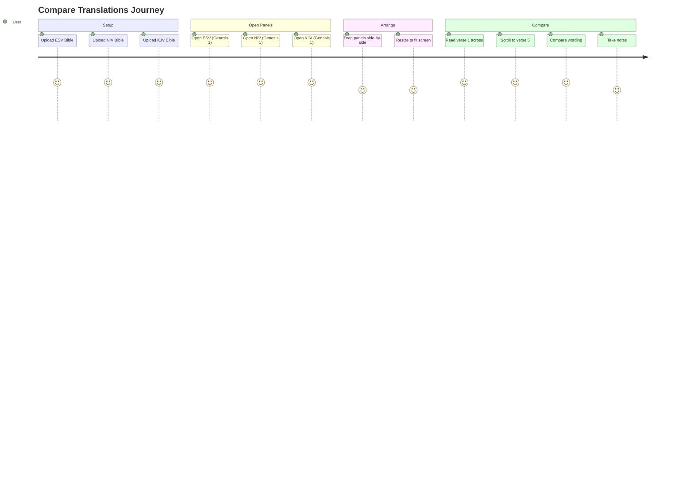

**Steps:**
1. User uploads 3 Bible translations (ESV, NIV, KJV)
2. User opens ESV in panel 1 (Genesis 1)
3. User opens NIV in panel 2 (Genesis 1)
4. User opens KJV in panel 3 (Genesis 1)
5. System arranges panels side-by-side
6. User resizes panels to optimal width
7. User reads verse 1 across all three
8. User scrolls synchronously (optional feature)
9. User compares translation differences
10. User navigates to other chapters/books

---

## Component Hierarchy

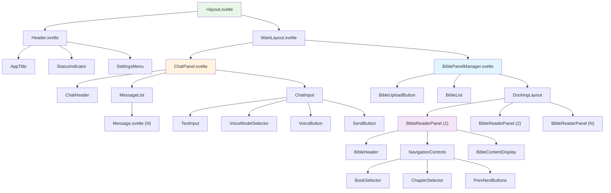

---

## API Architecture

### API Routes Structure

```
src/routes/api/
├── bible/
│   ├── upload/
│   │   └── +server.ts          POST - Upload Bible zip
│   ├── list/
│   │   └── +server.ts          GET  - List uploaded Bibles
│   └── convert/
│       └── [bibleId]/
│           └── [bookId]/
│               └── [chapter]/
│                   └── +server.ts  GET - Convert chapter to HTML
├── chat/
│   └── +server.ts              POST - Text chat
├── realtime/
│   └── token/
│       └── +server.ts          GET  - OpenAI session token
├── transcribe/
│   └── +server.ts              POST - Audio transcription
└── google-live/
    └── +server.ts              WebSocket - Gemini proxy
```

### API Endpoint Details

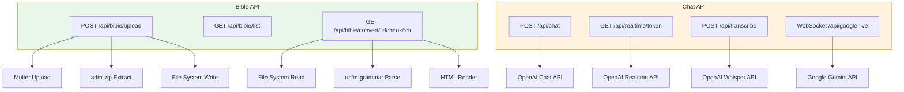

---

## State Management

### Svelte Stores Architecture

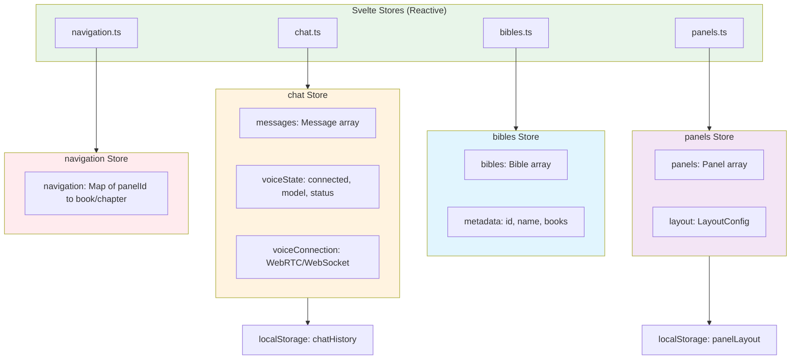

**Store Responsibilities:**

**chat.ts**
- Manage chat message history
- Track voice connection state (OpenAI/Gemini)
- Handle WebRTC/WebSocket instances
- Persist to localStorage

**bibles.ts**
- Store list of uploaded Bibles
- Cache Bible metadata (books, chapters)
- Provide lookup by bibleId

**panels.ts**
- Manage open Bible panels
- Store panel layout configuration
- Persist layout to localStorage
- Handle panel creation/removal

**navigation.ts**
- Track current book/chapter per panel
- Handle navigation history
- Provide navigation utilities (prev/next)

---

## File System Structure

```
read/
├── data/                        # USFM storage (server-side)
│   └── bibles/
│       ├── {bibleId-1}/
│       │   ├── 01GEN.usfm
│       │   ├── 02EXO.usfm
│       │   └── ...
│       └── {bibleId-2}/
│           └── ...
├── doc/                         # Documentation
│   ├── bible-reader-prd.md
│   ├── docking-library-evaluation.md
│   ├── usfm-conversion-evaluation.md
│   └── architecture.md (this file)
├── src/
│   ├── lib/
│   │   ├── components/          # Svelte components
│   │   │   ├── chat/
│   │   │   └── bible/
│   │   ├── stores/              # State management
│   │   │   ├── chat.ts
│   │   │   ├── bibles.ts
│   │   │   ├── panels.ts
│   │   │   └── navigation.ts
│   │   ├── usfm/                # USFM processing
│   │   │   ├── converter.ts
│   │   │   ├── converter.test.ts
│   │   │   └── parser.ts
│   │   └── chat/                # Chat utilities
│   │       ├── voice.ts
│   │       └── audio.ts
│   └── routes/
│       ├── +layout.svelte
│       ├── +page.svelte
│       └── api/                 # API routes
│           ├── bible/
│           ├── chat/
│           ├── realtime/
│           ├── transcribe/
│           └── google-live/
├── static/                      # Static assets
├── .env                         # Environment variables
├── package.json
└── vitest.config.ts
```

---

## Security Considerations

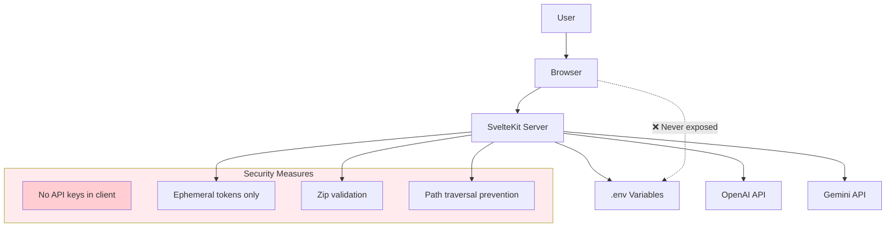

**Security Rules:**
1. **API Keys:** Never expose in client code, always server-side
2. **Token Generation:** Create ephemeral tokens for OpenAI Realtime
3. **File Uploads:** Validate zip structure, limit size (50MB), check MIME types
4. **Path Safety:** Prevent path traversal in file operations
5. **CORS:** Configure properly for production deployment

---

## Performance Targets

| Operation | Target | Notes |
|-----------|--------|-------|
| **Bible Upload** | < 5s | 10MB zip file |
| **USFM Conversion** | < 500ms | Per chapter |
| **Chapter Navigation** | < 200ms | With caching |
| **Panel Operations** | < 100ms | Create/resize/close |
| **Voice Latency** | < 2s | End-to-end (speech → response) |
| **Chat Response** | < 3s | OpenAI text chat |
| **Initial Load** | < 2s | App ready (no Bibles) |

---

## Future Enhancements

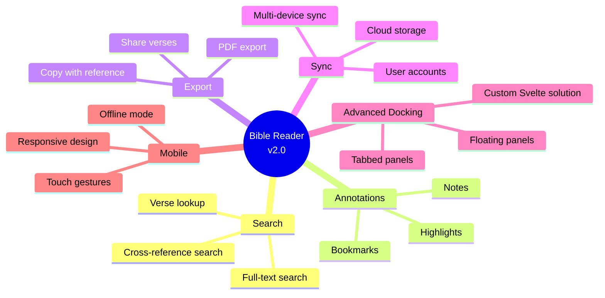

---

## Glossary

- **USFM:** Unified Standard Format Markers (Bible markup language)
- **USJ:** Unified Scripture JSON (intermediate JSON format)
- **usfm-grammar:** Tree-sitter based USFM parser library
- **WebRTC:** Real-time communication (OpenAI voice)
- **WebSocket:** Bidirectional streaming (Gemini voice)
- **Ephemeral Token:** Short-lived session token (OpenAI)
- **VAD:** Voice Activity Detection (speech detection)
- **PCM16:** 16-bit PCM audio format
- **Resampling:** Converting audio sample rate (e.g., 48kHz → 16kHz)

---

**Document Version:** 1.0  
**Last Updated:** May 2, 2026  
**Status:** Living Document (updated as implementation progresses)
